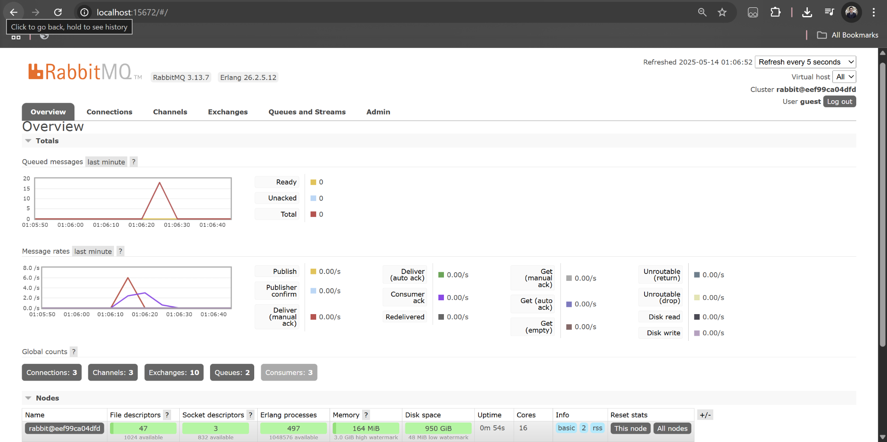
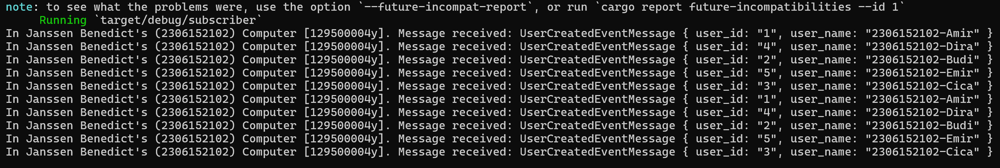
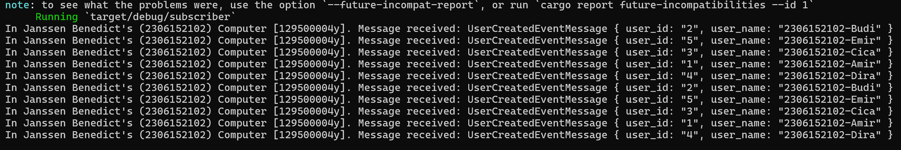
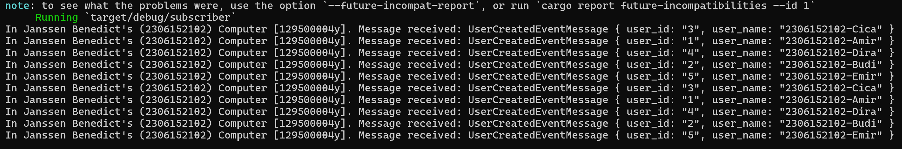

- Name: Janssen Benedict
- Class: Pemrograman Lanjut A
- NPM: 2306152102

### a. What is amqp?
AMQP, which stands for Advanced Message Queuing Protocol, is an open standard application layer protocol that is utilized for message-oriented middleware. AMQP allows systems to be able to communicate by passing messages in a reliable, secure, and platform-independent manner through message brokers, such as RabbitMQ. AMQP also supports helpful features, such as message queuing, routing, acknowledgments, and transactions. It enables decoupling between the producers and the consumers by having them exchange messages through a broker, making the system more scalable and maintainable because neither component needs to know of the internal workings of the other. AMQP is highly suited for microservices architectures and enterprise-grade applications due to its reliable message delivery, complex routing support, and interoperability across different platforms.

### b. What does it mean? guest:guest@localhost:5672 , what is the first guest, and what is the second guest, and what is localhost:5672 is for?
- The first guest in guest:guest@localhost:5672 is the username that is used to authenticate with RabbitMQ.
- The second guest in guest:guest@localhost:5672 is the password for the username that is used to authenticate with RabbitMQ.
- The localhost:5672 is the host (our local machine, "localhost") and the port (the default port used by RabbitMQ, "5672") where the RabbitMQ broker is running.

  On the "Queued messages" chart, we can see a drastic increase in the amount of queues. This is caused by the large amount of messages sent by the publisher to the message broker, but not yet processed by the slower subscriber. On my local machine, I reached the total amount of 30 queues. This is the result of the subcriber taking much more time to process each message in the queue, resulting in a queue buildup due to the publisher sending out messages faster than the subcriber can process them.

  The RabbitMQ browser after running three subscribers:

Subscriber 1:

Subscriber 2:

Subscriber 3:

On the "Queued messages" chart, we can see a decrease in the amount of queues when compared to when we only ran one subscriber. Before, the total amount of queues reached was 30 queues. Now, the total amount is 18 queues. This is due to each subscriber now receiving unique sets of messages when the publisher sends out a large quantity of them to the queue. The retrieval of the messages from the queue is now distributed to the three subscribers. And once the message has been successfully retrieved by a subcriber, it is removed from the queue and the message cannot be accessed by other subcribers.

### What to improve in the code for publisher and subscriber:
- Currently, in the subscriber's code, there is no form of graceful shutdown due to the subscriber running in an infinite loop with no proper shutdown handling. This could be replaced with proper signal handling to ensure a cleaner shutdown process, like tokio::signal.
- Currently, in the subscriber's code, the "durable: false" setting in the queue configuration means that the queue and all of its messages will not remain when the RabbitMQ server restarts. In a proper production environment, we want to ensure that the queue and its messages persist in case the server manages to crash or restart. This can be done by setting it to "durable: true".
- Currently, in both the publisher's code and the subscriber's code, logging is currently done using "println!" statements. In proper production-grade systems, structured logging using a logging crate or library should be used. This would allow for better debugging and analysis of logs.
- Currently, in the publisher's code, the event or message data is hardcoded directly, which limits the flexibility and reusability of the publisher program. To fix this, we should allow for dynamic input to be accepted by the publisher, such as reading message data from the command line.