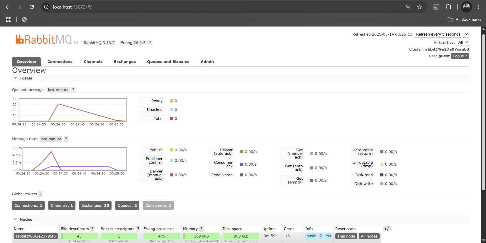

- Name: Janssen Benedict
- Class: Pemrograman Lanjut A
- NPM: 2306152102

### a. What is amqp?
AMQP, which stands for Advanced Message Queuing Protocol, is an open standard application layer protocol that is utilized for message-oriented middleware. AMQP allows systems to be able to communicate by passing messages in a reliable, secure, and platform-independent manner through message brokers, such as RabbitMQ. AMQP also supports helpful features, such as message queuing, routing, acknowledgments, and transactions. It enables decoupling between the producers and the consumers by having them exchange messages through a broker, making the system more scalable and maintainable because neither component needs to know of the internal workings of the other. AMQP is highly suited for microservices architectures and enterprise-grade applications due to its reliable message delivery, complex routing support, and interoperability across different platforms.

### b. What does it mean? guest:guest@localhost:5672 , what is the first guest, and what is the second guest, and what is localhost:5672 is for?
- The first guest in guest:guest@localhost:5672 is the username that is used to authenticate with RabbitMQ.
- The second guest in guest:guest@localhost:5672 is the password for the username that is used to authenticate with RabbitMQ.
- The localhost:5672 is the host (our local machine, "localhost") and the port (the default port used by RabbitMQ, "5672") where the RabbitMQ broker is running.

  On the "Queued messages" chart, we can see a drastic increase in the amount of queues. This is caused by the large amount of messages sent by the publisher to the message broker, but not yet processed by the slower subscriber. On my local machine, I reached the total amount of 30 queues. This is the result of the subcriber taking much more time to process each message in the queue, resulting in a queue buildup due to the publisher sending out messages faster than the subcriber can process them.
